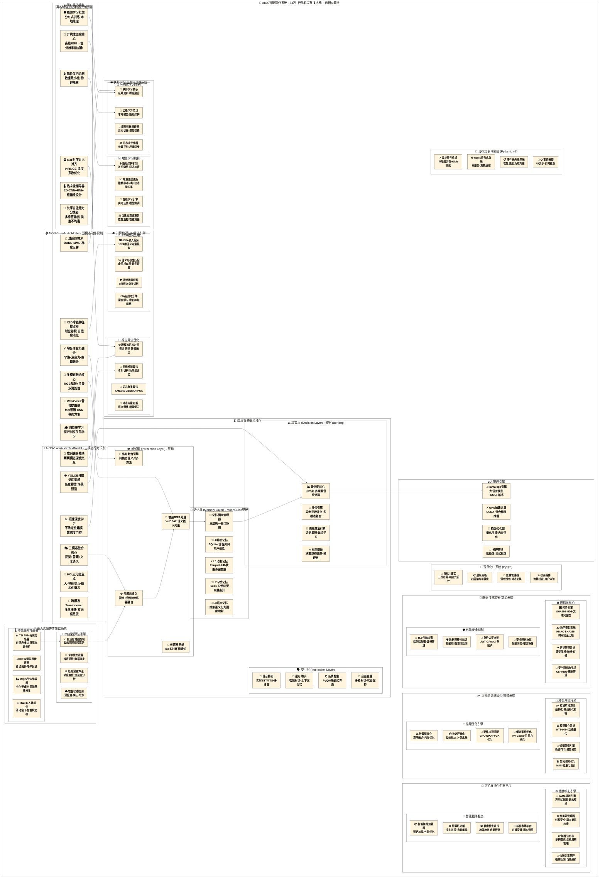

```mermaid
%%{init: {"theme": "base", "themeVariables": {"primaryTextColor": "#000", "primaryBorderColor": "#000", "clusterBkg": "transparent", "clusterBorder": "#000", "fontFamily": "Arial", "fontSize": "28px", "fontWeight": "bold"}}}%%

graph TB
    %% AIOS 超大型智能操作系统 - 完整深度技术架构图 + 自研AI算法
    %% 总计：532,636行代码，691个文件，10种编程语言 + 3大自研AI算法模型
    
    subgraph "🌟 AIOS智能操作系统 - 53万+行代码完整技术栈 + 自研AI算法"
        
        %% === 自研AI算法模型核心 ===
        subgraph "自研AI算法模型 "
            
            subgraph "🎬 AIOSVisionAudioModel - 双模态动作识别"
                VisionAudioCore["🎯 多模态融合核心<br/>RGB视频+音频双流处理"]
                X3DExtractor["🎥 X3D增强特征提取器<br/>时空卷积·自适应池化"]
                Wav2VecExtractor["🎵 Wav2Vec2音频提取器<br/>Mel频谱·CNN备选方案"]
                AttentionFusion["⚡ 增强注意力融合<br/>早期·注意力·晚期融合"]
                DomainAdapt["🔄 域适应技术<br/>DANN·MMD·梯度反转"]
                SelfSupervised["🎓 自监督学习<br/>视听对应关系学习"]
            end
            
            subgraph "异构域自适应家庭行为识别"
                HeteroCore["🏡 异构域适应核心<br/>高维RGB→低分辨率热成像"]
                PrivacyProtect["🔒 隐私保护机制<br/>数据最小化·物理隔离"]
                FederatedLearning["🌐 联邦学习框架<br/>分布式训练·本地推理"]
                C3TAlignment["⏰ C3T时序对比对齐<br/>InfoNCE·温度系数优化"]
                ThermalEncoding["🌡️ 热成像编码器<br/>2D-CNN+RNN·轻量级设计"]
                SharedClassifier["🎯 共享自注意力分类器<br/>多标签输出·类别不均衡"]
            end
            
            subgraph "📝 AIOSVisionAudioTextModel - 三模态行为识别"
                TriModalCore["🎭 三模态融合核心<br/>视觉+音频+文本语义"]
                YOLOEIntegration["👁️ YOLOE开放词汇集成<br/>任意物体·场景识别"]
                HOIGeneration["🤝 HOI三元组生成<br/>人-物体交互·结构化语义"]
                PairwiseFusion["🔗 成对融合模块<br/>两两模态深度交互"]
                CrossModalTransformer["🔄 跨模态Transformer<br/>多层堆叠·双向信息流"]
                EDLUncertainty["📊 证据深度学习<br/>不确定性建模·置信度门控"]
            end
        end
         subgraph "🧩 可扩展插件生态平台"
            
            subgraph "⚙️ 插件核心引擎"
                YAMLEngine["📝 YAML规则引擎<br/>声明式配置·动态解析"]
                HotReload["🔥 热重载管理器<br/>线程安全·版本兼容检查"]
                PluginRegistry["📋 插件注册表<br/>单例模式·生命周期管理"]
                DependencyMgr["🔗 依赖关系管理<br/>循环检测·自动解析"]
            end
            
            subgraph "🚀 智能插件服务"
                PluginLoader["📦 智能插件加载器<br/>延迟加载·性能优化"]
                ConfigManager["⚙️ 配置热更新<br/>实时监控·自动重载"]
                HealthCheck["❤️ 健康检查监控<br/>故障检测·自动恢复"]
                PluginMarket["🛒 插件市场平台<br/>在线安装·版本管理"]
            end
        end
        %% === 四层智能架构核心 ===
        subgraph "🏗️ 四层智能架构核心 "
            
            subgraph "🗣️ 交互层 (Interaction Layer)"
                VoiceUI["🎤 语音界面<br/>实时STT/TTS·多语言"]
                Assistant["🤖 星月助手<br/>智能对话·上下文记忆"]
                SysControl["🖱️ 系统控制<br/>PyQt6导航式界面"]
                SessionMgr["💬 会话管理<br/>多轮对话·状态保持"]
            end
            
            subgraph "👁️ 感知层 (Perception Layer) - 星璇"
                MultiModal["🌐 多模态输入<br/>视觉+音频+传感器融合"]
                JEPA["🧠 增强JEPA处理<br/>V-JEPA2·语义嵌入向量"]
                FusionEngine["🔄 感知融合引擎<br/>跨模态语义对齐算法"]
                SensorNet["📡 传感器网络<br/>IoT实时环境感知"]
            end
            
            subgraph "🧠 记忆层 (Memory Layer) - MoonGuide望舒"
                L0Static["💾 L0静态记忆<br/>SQLite·设备房间用户信息"]
                L1Dynamic["⚡ L1动态记忆<br/>Parquet·24h状态滑窗数据"]
                L2Habit["🎯 L2习惯记忆<br/>Faiss·习惯原型向量索引"]
                L3Semantic["🔗 L3语义记忆<br/>抽象语义行为图谱映射"]
                MemoryGraph["🌙 记忆图谱管理器<br/>三层统一接口协调"]
            end
            
            subgraph "⚖️ 决策层 (Decision Layer) - 曜衡YaoHeng"
                ConfidenceCore["📊 置信度核心<br/>贝叶斯·多维置信度计算"]
                CompensationEngine["🔧 补偿引擎<br/>异步字段补全·多模态融合"]
                AdvancedAlgo["🧮 高级算法引擎<br/>证据累积·集成学习"]
                ReasoningGraph["💡 推理图谱<br/>决策路径追踪·推理链"]
            end
        end
        
        %% === 嵌入式硬件传感器层 ===
        subgraph "🔧 嵌入式硬件传感器系统 "
            
            subgraph "🌡️ 环境感知传感器"
                TSL2584["☀️ TSL2584光照传感器<br/>自适应增益·环境光谱分析"]
                DHT22["💧 DHT22温湿度传感器<br/>重试机制·噪声过滤"]
                MQ35["🌬️ MQ35气体传感器<br/>卡尔曼滤波·智能基线校准"]
                HW740["👤 HW740人体红外<br/>滑动窗口·智能状态机"]
            end
            
            subgraph "🎯 传感器算法引擎"
                AdaptiveGain["📈 自适应增益控制<br/>动态范围调节算法"]
                KalmanFilter["🔬 卡尔曼滤波器<br/>噪声消除·数据稳定"]
                TrendPrediction["📊 趋势预测算法<br/>浓度变化·加速度分析"]
                StateDetection["🎮 智能状态检测<br/>预检测·确认·冷却"]
            end
        end
        
        %% === 计算机视觉AI算法层 ===
        subgraph "👁️ 计算机视觉AI算法引擎"
            
            subgraph "🎨 JEPA视觉处理"
                VisionEmbedding["🖼️ JEPA嵌入服务<br/>1024维语义向量提取"]
                SemanticMatching["🔍 语义相似性匹配<br/>余弦相似度·欧氏距离"]
                SceneUnderstanding["🏞️ 视觉场景理解<br/>8类语义分类识别"]
                FeatureExtraction["⚡ 特征提取引擎<br/>深度学习·卷积神经网络"]
            end
            
            subgraph "🧮 视觉算法优化"
                SemanticClustering["🔗 语义聚类算法<br/>KMeans·DBSCAN·PCA"]
                DynamicUpdate["🔄 动态向量更新<br/>语义漂移·增量学习"]
                CrossModalAlign["🌐 跨模态语义对齐<br/>视觉-语言-音频融合"]
                ObjectDetection["🎯 目标检测算法<br/>实时识别·边界框定位"]
            end
        end
        
        %% === 联邦学习与分布式训练 ===
        subgraph "🌐 联邦学习·分布式训练系统"
            
            subgraph "🏫 分布式学习架构"
                ModelTraining["🧠 模型训练管理器<br/>异步训练·模型切换"]
                FederatedCore["🤝 联邦学习核心<br/>私域更新·梯度聚合"]
                EdgeLearning["📱 边缘学习节点<br/>本地模型·隐私保护"]
                DistributedOpt["⚖️ 分布式优化器<br/>参数平均·权重同步"]
            end
            
            subgraph "📊 增量学习机制"
                IncrementalUpdate["📈 增量原型更新<br/>指数移动平均·动态学习率"]
                OnlineLearning["🔄 在线学习引擎<br/>实时反馈·模型微调"]
                AdaptiveWeight["⚖️ 自适应权重更新<br/>性能监控·权重调整"]
                PrivacyPreserve["🔒 隐私保护机制<br/>差分隐私·同态加密"]
            end
        end
        
        %% === 可扩展插件生态平台 ===
       
        
        %% === 大模型训练优化·剪枝系统 ===
        subgraph "✂️ 大模型训练优化·剪枝系统"
            
            subgraph "🎯 模型压缩技术"
                ModelPruning["✂️ 权重剪枝算法<br/>结构化·非结构化剪枝"]
                Quantization["📊 模型量化系统<br/>INT8·INT4·动态量化"]
                Distillation["🏫 知识蒸馏引擎<br/>教师-学生模型框架"]
                Architecture["🏗️ 架构搜索优化<br/>NAS·轻量化设计"]
            end
            
            subgraph "⚡ 推理优化引擎"
                GraphOptimize["📈 计算图优化<br/>算子融合·内存优化"]
                BatchOptimize["📦 批处理优化<br/>动态批大小·流水线"]
                HardwareAccel["🚀 硬件加速适配<br/>GPU·NPU·FPGA优化"]
                CacheStrategy["💾 缓存策略优化<br/>KV-Cache·注意力优化"]
            end
        end
        
        %% === 数据传输加密·安全系统 ===
        subgraph "🔐 数据传输加密·安全系统"
            
            subgraph "🔒 密码学核心"
                HashEngine["#️⃣ 哈希引擎<br/>SHA256·MD5·文件完整性"]
                DigitalSign["✍️ 数字签名系统<br/>HMAC-SHA256·时间安全比较"]
                KeyManagement["🗝️ 密钥管理系统<br/>密钥生成·轮换·存储"]
                RandomGen["🎲 安全随机数生成<br/>CSPRNG·熵源管理"]
            end
            
            subgraph "🛡️ 传输安全机制"
                TLSEncryption["🔐 TLS传输加密<br/>端到端加密·证书管理"]
                DataIntegrity["🛡️ 数据完整性验证<br/>校验和·防篡改检测"]
                AuthProtocol["🔑 身份认证协议<br/>JWT·OAuth2·多因子"]
                SecureComm["📡 安全通信协议<br/>加密消息·密钥协商"]
            end
        end
        
        %% === AI推理引擎 ===
        subgraph "🔥 AI推理引擎 "
            LlamaCPP["🦙 llama.cpp引擎<br/>大语言模型·GGUF格式"]
            GPUAccel["⚡ GPU加速计算<br/>CUDA·混合精度推理"]
            ModelOpt["🎯 模型优化器<br/>量化压缩·内存优化"]
            InferPipeline["🔄 推理管道<br/>批处理·流式推理"]
        end
        
        %% === 现代化UI系统 ===
        subgraph "🎨 现代化UI系统 (PyQt6)"
            NavWindow["🧭 导航主窗口<br/>三栏布局·响应式设计"]
            LayerPanels["📋 层级面板<br/>四层架构可视化"]
            ThemeManager["🎨 主题管理器<br/>深色浅色·动态切换"]
            AnimatedComponents["✨ 动画组件<br/>流畅过渡·用户体验"]
        end
        
        %% === 分布式事件总线 ===
        subgraph "📡 分布式事件总线 (Pydantic v2)"
            AsyncBus["⚡ 异步事件总线<br/>本地高并发·Glob匹配"]
            RedisBus["🌐 Redis分布式总线<br/>跨服务·集群通信"]
            EventPriority["📋 事件优先级系统<br/>智能调度·负载均衡"]
            EventBridge["🌉 Qt事件桥接<br/>UI异步·实时更新"]
        end
    end
    
    %% === 自研算法与系统集成连接 ===
    %% 双模态算法集成
    VisionAudioCore --> JEPA
    X3DExtractor --> VisionEmbedding
    AttentionFusion --> FusionEngine
    DomainAdapt --> FederatedCore
    
    %% 异构域适应算法集成
    HeteroCore --> EdgeLearning
    PrivacyProtect --> PrivacyPreserve
    C3TAlignment --> CrossModalAlign
    FederatedLearning --> FederatedCore
    
    %% 三模态算法集成
    TriModalCore --> MultiModal
    YOLOEIntegration --> ObjectDetection
    PairwiseFusion --> CrossModalAlign
    EDLUncertainty --> ConfidenceCore
    
    %% 主要数据流向（简化）
    TSL2584 --> AdaptiveGain
    AdaptiveGain --> MultiModal
    MultiModal --> JEPA
    JEPA --> MemoryGraph
    MemoryGraph --> ConfidenceCore
    ConfidenceCore --> LlamaCPP
    
    %% 样式定义
    classDef ai_model font-size:28px,font-weight:bold
    classDef sensor font-size:24px,font-weight:bold
    classDef vision font-size:24px,font-weight:bold
    classDef federated font-size:24px,font-weight:bold
    classDef plugin font-size:24px,font-weight:bold
    classDef optimization font-size:24px,font-weight:bold
    classDef security font-size:24px,font-weight:bold
    classDef core font-size:26px,font-weight:bold
    classDef ui font-size:24px,font-weight:bold
    classDef eventbus font-size:24px,font-weight:bold
    
    %% 应用样式
    class VisionAudioCore,X3DExtractor,Wav2VecExtractor,AttentionFusion,DomainAdapt,SelfSupervised,HeteroCore,PrivacyProtect,FederatedLearning,C3TAlignment,ThermalEncoding,SharedClassifier,TriModalCore,YOLOEIntegration,HOIGeneration,PairwiseFusion,CrossModalTransformer,EDLUncertainty ai_model
    class TSL2584,DHT22,MQ35,HW740,AdaptiveGain,KalmanFilter,TrendPrediction,StateDetection sensor
    class VisionEmbedding,SemanticMatching,SceneUnderstanding,FeatureExtraction,SemanticClustering,DynamicUpdate,CrossModalAlign,ObjectDetection vision
    class ModelTraining,FederatedCore,EdgeLearning,DistributedOpt,IncrementalUpdate,OnlineLearning,AdaptiveWeight,PrivacyPreserve federated
    class YAMLEngine,HotReload,PluginRegistry,DependencyMgr,PluginLoader,ConfigManager,HealthCheck,PluginMarket plugin
    class ModelPruning,Quantization,Distillation,Architecture,GraphOptimize,BatchOptimize,HardwareAccel,CacheStrategy optimization
    class HashEngine,DigitalSign,KeyManagement,RandomGen,TLSEncryption,DataIntegrity,AuthProtocol,SecureComm security
    class VoiceUI,Assistant,SysControl,SessionMgr,MultiModal,JEPA,FusionEngine,SensorNet,L0Static,L1Dynamic,L2Habit,L3Semantic,MemoryGraph,ConfidenceCore,CompensationEngine,AdvancedAlgo,ReasoningGraph,LlamaCPP,GPUAccel,ModelOpt,InferPipeline core
    class NavWindow,LayerPanels,ThemeManager,AnimatedComponents ui
    class AsyncBus,RedisBus,EventPriority,EventBridge eventbus
```