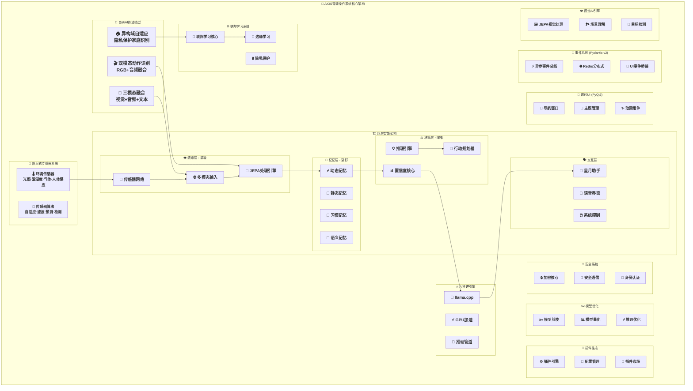

```mermaid

graph TB
    %% AIOS 智能操作系统 - 优化版技术架构图
    %% 53万+行代码，691个文件
    
    subgraph "🌟 AIOS智能操作系统核心架构"
        
        %% === 自研AI算法模型 ===
        subgraph "🧠 自研AI算法模型"
            VisionAudio["🎬 双模态动作识别<br/>RGB+音频融合"]
            HeteroHome["🏠 异构域自适应<br/>隐私保护家庭识别"] 
            TriModal["📝 三模态融合<br/>视觉+音频+文本"]
        end
         %% === 插件生态平台 ===
        subgraph "🧩 插件生态"
            PluginEngine["⚙️ 插件引擎"]
            ConfigMgr["📝 配置管理"]
            PluginMarket["🛒 插件市场"]
        end
        
        %% === 模型优化系统 ===
        subgraph "✂️ 模型优化"
            ModelPruning["✂️ 模型剪枝"]
            Quantization["📊 模型量化"] 
            InferOpt["⚡ 推理优化"]
        end
        
        %% === 安全系统 ===
        subgraph "🔐 安全系统"
            CryptoCore["🔒 加密核心"]
            SecureComm["📡 安全通信"]
            AuthSystem["🔑 身份认证"]
        end
        

    

        %% === 四层智能架构 ===
        subgraph "🏗️ 四层智能架构"
            
            subgraph "🗣️ 交互层"
                VoiceUI["🎤 语音界面"]
                Assistant["🤖 星月助手"]
                SysControl["🖱️ 系统控制"]
            end
            
            subgraph "👁️ 感知层 - 星璇"
                MultiModal["🌐 多模态输入"]
                JEPA["🧠 JEPA处理引擎"]
                SensorNet["📡 传感器网络"]
            end
            
            subgraph "🧠 记忆层 - 望舒"
                L0Static["💾 静态记忆"]
                L1Dynamic["⚡ 动态记忆"] 
                L2Habit["🎯 习惯记忆"]
                L3Semantic["🔗 语义记忆"]
            end
            
            subgraph "⚖️ 决策层 - 曜衡"
                ConfidenceCore["📊 置信度核心"]
                ReasoningEngine["💡 推理引擎"]
                ActionPlanner["🎯 行动规划器"]
            end
        end
        
        %% === 硬件传感器层 ===
        subgraph "🔧 嵌入式传感器系统"
            EnvSensors["🌡️ 环境传感器<br/>光照·温湿度·气体·人体感应"]
            SensorAlgo["🎯 传感器算法<br/>自适应·滤波·预测·检测"]
        end
        
      
        
        %% === 分布式学习系统 ===
        subgraph "🌐 联邦学习系统"
            FederatedCore["🤝 联邦学习核心"]
            EdgeLearning["📱 边缘学习"]
            PrivacyEngine["🔒 隐私保护"]
        end
        
        
                %% === UI系统 ===
        subgraph "🎨 现代UI (PyQt6)"
            NavWindow["🧭 导航窗口"]
            ThemeManager["🎨 主题管理"]
            AnimatedUI["✨ 动画组件"]
        end
        
        %% === 事件总线 ===
        subgraph "📡 事件总线 (Pydantic v2)"
            AsyncBus["⚡ 异步事件总线"]
            RedisBus["🌐 Redis分布式"]
            EventBridge["🌉 UI事件桥接"]
        end

          %% === 计算机视觉引擎 ===
        subgraph "👁️ 视觉AI引擎"
            VisionCore["🖼️ JEPA视觉处理"]
            SceneAI["🏞️ 场景理解"]
            ObjectAI["🎯 目标检测"]
        end
        
       
        %% === AI推理引擎 ===
        subgraph "🔥 AI推理引擎"
            LlamaCPP["🦙 llama.cpp"]
            GPUAccel["⚡ GPU加速"]
            InferPipeline["🔄 推理管道"]
        end
        
        
        
        
    end
    
    %% === 主要数据流 ===
    EnvSensors --> SensorNet
    SensorNet --> MultiModal
    MultiModal --> JEPA
    JEPA --> L1Dynamic
    L1Dynamic --> ConfidenceCore
    ConfidenceCore --> LlamaCPP
    LlamaCPP --> Assistant
    
    %% 算法集成流
    VisionAudio --> JEPA
    HeteroHome --> FederatedCore
    TriModal --> MultiModal
    
    %% 系统间协作
   
    FederatedCore --> EdgeLearning
   
    
    
    
    %% UI和事件流
   
    ReasoningEngine --> ActionPlanner
    
    %% === 样式定义 ===
    classDef aiModel font-size:22px,font-weight:bold
    classDef coreLayer font-size:20px,font-weight:bold
    classDef hardware font-size:18px,font-weight:bold
    classDef vision font-size:18px,font-weight:bold
    classDef distributed font-size:18px,font-weight:bold
    classDef plugin font-size:18px,font-weight:bold
    classDef optimization font-size:18px,font-weight:bold
    classDef security font-size:18px,font-weight:bold
    classDef inference font-size:20px,font-weight:bold
    classDef ui font-size:18px,font-weight:bold
    classDef eventbus font-size:18px,font-weight:bold
    
    %% 应用样式
    class VisionAudio,HeteroHome,TriModal aiModel
    class VoiceUI,Assistant,SysControl,MultiModal,JEPA,SensorNet,L0Static,L1Dynamic,L2Habit,L3Semantic,ConfidenceCore,ReasoningEngine,ActionPlanner coreLayer
    class EnvSensors,SensorAlgo hardware
    class VisionCore,SceneAI,ObjectAI vision
    class FederatedCore,EdgeLearning,PrivacyEngine distributed
    class PluginEngine,ConfigMgr,PluginMarket plugin
    class ModelPruning,Quantization,InferOpt optimization
    class CryptoCore,SecureComm,AuthSystem security
    class LlamaCPP,GPUAccel,InferPipeline inference
    class NavWindow,ThemeManager,AnimatedUI ui
    class AsyncBus,RedisBus,EventBridge eventbus
```